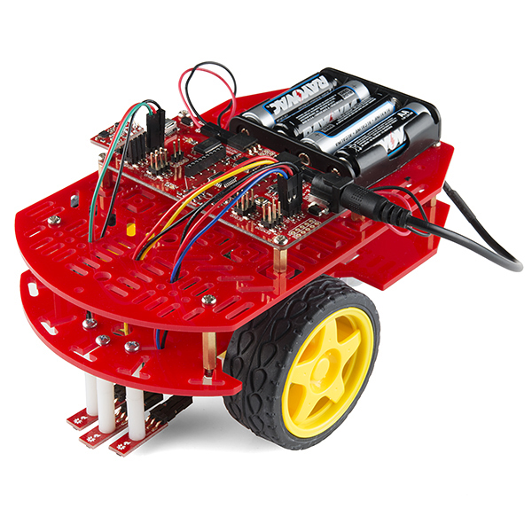

# Hardware Version 3 #
Firmware made compatbile with [Sparkfun RedBot](https://www.sparkfun.com/products/12032)
Images copyrighted by [Sparkfun](https://www.sparkfun.com/)

## Photo ##

## Wiring ##

## Pin configuration ##
0. RX (Serial)
1. TX (Serial)
2. 
3. 
4. 
5. 
6. 
7. 
8. 
9. 
10. 
11. 
12. 
13. 

A0. 
A1. 
A2. 
A3. 
A4.
A5.

TWI In.
TWI Out.